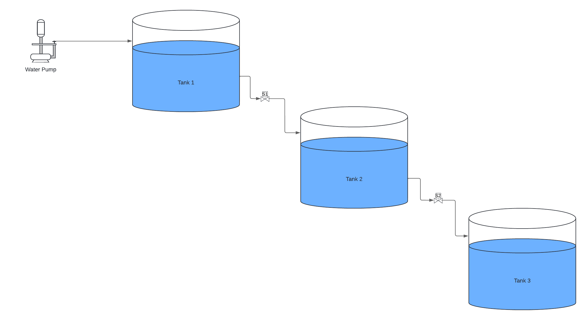
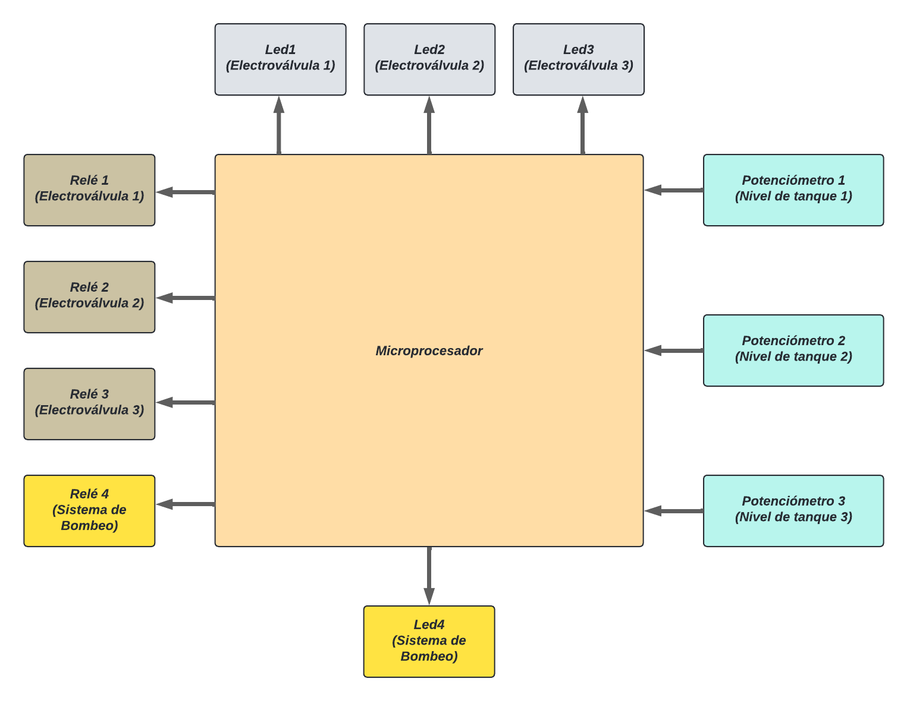

## Assignment 1

The ultimate goal is to develop a system to maintain the water level of 3 water tanks that are used to provide drinking water for cattle on a farm in the north of Córdoba (Villa del Totoral).

The system must maintain the water level of 3 tanks, each with a capacity of 100,000 liters. The water is used to provide drinking water for cattle on a farm in Villa del Totoral, north of Córdoba.

Tank 1 is filled using a submersible pump that is started with a generator. When the tank's water level is below a minimum level, the pumping system activates and fills the tank until it reaches the fill level.

Tank 2 is supplied by gravity from tank 1. When the water level in tank 2 is below the minimum level (fill threshold), a solenoid valve opens in tank 1, allowing tank 2 to be filled up to its fill level. This causes the water level in tank 1 to decrease, and if it reaches the minimum level, the pumping system starts again. When tank 2 reaches its fill level, the solenoid valve in tank 1 closes.

Tank 3 is supplied by gravity from tank 2. When the water level in tank 3 is below the minimum level (fill threshold), a solenoid valve opens in tank 2, allowing tank 3 to be filled up to its fill level.

Below you can find a diagram of the system.

The system can operate in manual or automatic mode (in manual mode, the user is responsible for pressing buttons to activate/deactivate the pumping system and solenoid valves).

The user can request the following information via the serial port:

* Water level of the tanks.
* Status of the pumping system (ON/OFF).
* Status of the solenoid valves.

To complete practical work 1, the following peripherals will be used:

* POTENTIOMETER 1: Will be used to represent the water level of tank 1.
* POTENTIOMETER 2: Will be used to represent the water level of tank 2.
* POTENTIOMETER 3: Will be used to represent the water level of tank 3.
* RELAY 1: Activation/deactivation of valve 1.
* RELAY 2: Activation/deactivation of valve 2.
* RELAY 3: Activation/deactivation of the pumping system.
* LED 1: Indicates the status of solenoid valve 1.
* LED 2: Indicates the status of solenoid valve 2.
* LED 3: Indicates the status of the pumping system.

## Note

Since the knowledge of this topic is found in chapter 3 of the book, I've implemented a debounce function without using Finite State Machines (FSM).